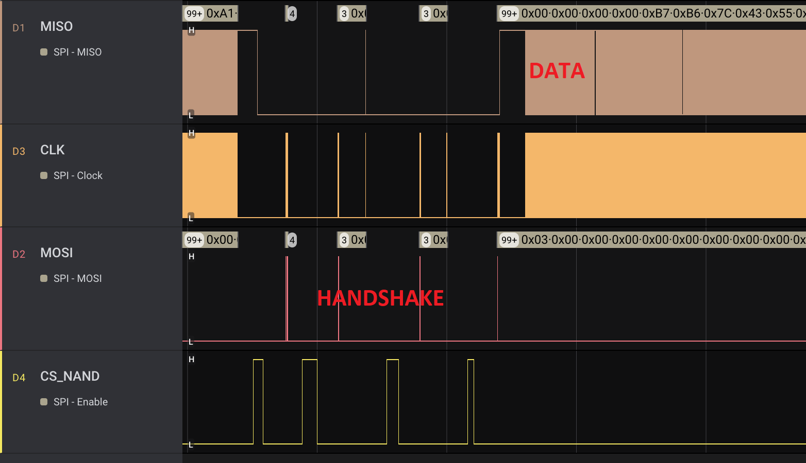

# Rooting the Cradlepoint IBR600C Router

This is a write-up of a project I did with [stulle123](https://github.com/stulle123) on the Cradlepoint `IBR600C-150M-B-EU` router (firmware version `7.22.60`).

* [IBR600C Flash Dump](#ibr600c-flash-dump)
  * [Dumping NOR](#dumping-nor)
  * [Boarding the U-Boot](#boarding-the-u-boot)
  * [Dumping NAND](#dumping-nand)
* [Preparing our Custom Firmware Image](#preparing-our-custom-firmware-image)
  * [Patching the cpshell](#patching-the-cpshell)
  * [Getting a Persistent U-Boot Console](#getting-a-persistent-u-boot-console)
  * [Building the Squashfs ROOTFS Image](#building-the-squashfs-rootfs-image)
* [Flashing the new Firmware ](#flashing-the-new-firmware)
  * [Preparing the Kernel Image](#preparing-the-kernel-image)
  * [Flashing the NAND Images](#flashing-the-nand-images)
    * [Booting OpenWRT](#booting-openwrt)
    * [Flashing our Custom Kernel and ROOTFS](#flashing-our-custom-kernel-and-rootfs)
* [Responsible Disclosure](#responsible-disclosure)

## IBR600C Flash Dump

It was a sunny :sunny: day in September 2022 when someone put this device on my desk:


The `IBR600C` is a LTE modem and router with Wifi, LAN and WAN interfaces. It has an embedded web server and cloud connectivity to [Cradlepoint's NetCloud](https://accounts.cradlepointecm.com/) service. The device's firmware is based on Linux and the main applications (shell, web server, sshd, etc.) are almost completely written in Python.

I could not resist to open the box and see if I could get some information about the boot process and eventually the firmware. The main processor is a `Qualcomm IPQ4018` with SDRAM, NOR and NAND flash memory. The combination of NOR and NAND flash is common: bootloaders in NOR, OS and applications in NAND. Both flashes are connected via the same SPI bus to the Qualcomm processor.

A UART interface is easily accessible:


At boot time this interface only outputs very limited information about the first bootloader, after that it becomes silent 😞

Here's a picture of the router hooked up to a logic analyzer, Bus Pirate and UART:


### Dumping NOR

The NOR flash is easy to dump with a [Bus Pirate](http://dangerousprototypes.com/docs/Bus_Pirate) and [flashrom](https://www.flashrom.org/Flashrom). The content is not encrypted and Secure Boot is not in place.

Here are the steps to dump the NOR flash:

1. Connect the Bus Pirate SPI interface to the NOR flash located on the backside of the PCB:

2. Put the main processor in `RESET` state. This is needed because we can't have two SPI masters. 
3. Power on the device and dump the flash with flashrom (change the serial interface's name as needed):
```
$ flashrom -V -p buspirate_spi:dev=/dev/tty.usbserial-AG0JGQV3,serialspeed=230400 -n -r nor_dump.bin
```

### Boarding the U-Boot

The U-Boot environmental variables, part of the flash dump, are a good starting point. In our case, the `silent` variable is present:

> silent=yes

We can just change it to `no`.

**Caveat**: a CRC32 checksum of the whole NOR flash block (65536 bytes) protects the integrity of the U-Boot environmental variables. It is placed at the very beginning of the flash block and must be recalculated (CRC32 value excluded, i.e. 65536-4 bytes). 

Now the NOR flash memory can be re-flashed:

```
$ flashrom -V -p buspirate_spi:dev=/dev/tty.usbserial-AG0JGQV3,serialspeed=230400 -n -w nor_dump_nosilent.bin
```

During next boot we have a U-Boot console by just pressing any key: 😂

```
U-Boot 

smem ram ptable found: ver: 1 len: 3
RAM Configuration:
Bank #0: 80000000 256 MiB

DRAM:  256 MiB
NAND:  spi_nand: spi_nand_flash_probe SF NAND ID 0:ef:ab:21
SF: Detected W25M02GV with page size 2 KiB, total 256 MiB
SF: Detected W25Q64 with page size 4 KiB, total 8 MiB
ipq_spi: page_size: 0x100, sector_size: 0x1000, size: 0x800000
264 MiB
MMC:

SW Version: v0.0.3
machid: 8010100
Net:   
configuring gpio 52 as func 2
configuring gpio 53 as func 2
configuring gpio 62 as func 0 (output) 0
MAC0 addr 00:30:44:00:00:00
mdio init of IPQ MDIO0 in PSGMII mode
PHY ID1: 0x4d
PHY ID2: 0xd0b1
eth0
Ready.

Please choose the operation: 

   1: Load system code to SDRAM via TFTP. 
   2: Load system code then write to Flash via TFTP. 
   3: Boot system code via Flash (default).
   4: Enter boot command line interface.
   7: Validate Image 1 and Image 2. 
   8: Write SNV area information. 
   9: Load Boot Loader code then write to Flash via TFTP. 
 9 ... 0 
```

At this point it is possible to load any live image into the router's SDRAM via TFTP.

### Dumping NAND 

The NAND flash is more difficult to dump. I sniffed the SPI bus during the boot phase with the [Saleae](https://www.saleae.com/) logic analyzer. There are two big copy transactions going on. They correspond to the Linux kernel and the root file system being downloaded from NAND to SRAM.

Here is the recording of the rootfs download:


For extracting the rootfs contents some post processing is required. First, the raw data is extracted with Saleae's SPI decoder feature and transformed into binary with a simple [Python script](./scripts/make_bin.py). However, the raw data still contains some handshake information, see the waveform:



With a [second script](./scripts/extract_nand.py) we can remove the handshakes. Then we also remove all `0xFFFFFFFF` at the end of the binary file.

Finally, we have the root file system:

```
$ binwalk rootfs.cradl
DECIMAL       HEXADECIMAL     DESCRIPTION
--------------------------------------------------------------------------------
0             0x0             Squashfs filesystem, little endian, version 4.0, compression:xz, size: 18464354 bytes, 2026 inodes, blocksize: 262144 bytes, created: 2022-06-02 18:01:34
```

With the `unsquashfs` tool we can proceed to extract all files.

To get the kernel image just repeat the same steps as described above.

## Preparing our Custom Firmware Image

The router has a custom shell implemented in Python called *cpshell* which is accessible via SSH or the web interface. However, this is not a "normal" Linux shell as it only supports limited commands for configuring the router. It provides a protected `sh` command that spawns `/bin/sh` available to Cradlepoint's remote technical support. We can patch the firmware to enable the `sh` command for us.

### Patching the cpshell

In the rootfs's `/service_manager/` directory there is a Python bytecode file called `cpshell.pyc`. After decompiling it with [decompyle3](https://github.com/rocky/python-decompile3/), the following interesting code blocks can be found:

```python
if self.superuser:
   self.cmds.update({'sh':(
      self.sh, 'Internal Use Only'), 
     'python':(
      self.python, 'Internal Use Only')})
```

And:

```python
def sh(self):
   self.fork_exec(lambda: os.execl('/bin/sh', 'sh'))
```

The variable `superuser` is initialized to `False` :face_with_spiral_eyes: So, we just need to patch the branch condition...

[decompyle3](https://github.com/rocky/python-decompile3/) is not able to decompile the entire `cpshell.pyc` file, so we can't just update the resulting Python code and recompile it. In fact, we need to patch the Python byte code (`.pyc`) itself.

To do this, we first need to disassemble the `cpshell.pyc` file with [pydisasm](https://github.com/rocky/python-xdis):

```bash
$ pydisasm --format xasm cpshell.pyc > cpshell.pyasm
```

In the resulting assembly code we can then search for the variable `superuser` and the branches associated to this variable. Here's the branch related to the code above:

```assembly
237:
            LOAD_FAST            0 (self)
            LOAD_ATTR            13 (superuser)
            EXTENDED_ARG         1 (256)
            POP_JUMP_IF_FALSE    L500 (to 500)
```

We need to find the position of this `POP_JUMP_IF_FALSE` branch in the `cpshell.pyc` file and just replace it with `POP_JUMP_IF_TRUE`. With the following piece of code we can print out the opcodes related to the assembly code above:

```python
import opcode

for op in ['LOAD_FAST', 'LOAD_ATTR', 'EXTENDED_ARG', 'POP_JUMP_IF_FALSE']:
   print('%-16s%s' % (op, opcode.opmap[op].to_bytes(1,byteorder='little')))
```

A Python bytecode instruction is (mostly) composed of the 8 bit opcode and a 8 bit variable reference. In our case we can reconstruct the following binary sequence associated with the disassembly above:

```
0x7c 0x00 0x6a 0x0d 0x90 0x01 0x72
```

Next, we open the `cpshell.pyc` file with a hex editor and search for the byte sequence (there's only one match). 

With Python's `opcode` library we can find the opcode for `POP_JUMP_IF_FALSE` -- `0x73` -- and replace the sequence `0x7c 0x00 0x6a 0x0d 0x90 0x01 0x72` with `0x7c 0x00 0x6a 0x0d 0x90 0x01 0x73`. The cpshell is now patched and the `sh` command works out of the box.

### Getting a Persistent U-Boot Console

The router includes a feature that (re-)enables silent boot every time it starts. We also need to disable this feature to maintain a persistent U-Boot console. In the `/service_manager/services/` folder we find a file called `silentboot.pyc`. Let's decompile it with [decompyle3](https://github.com/rocky/python-decompile3/) again (this time error-free):

```python
import services, cp
from services.utils.ubootenv import UbootEnv

class SilentBoot(services.Service):

    name = 'silentboot'
    __startup__ = 100
    __shutdown__ = 100

    def onStart(self):
        env = UbootEnv()
        if env.read('silent') != 'yes':
            env.write('silent', 'yes')
        if env.read('bootdelay') != '1':
            env.write('bootdelay', '1')

if cp.platform == 'router':
    services.register(SilentBoot)
```

We see that the U-Boot `silent` variable is changed to `yes`. We can remove this:

```python
import services, cp
from services.utils.ubootenv import UbootEnv

class SilentBoot(services.Service):
    name = 'silentboot'
    __startup__ = 100
    __shutdown__ = 100

    def onStart(self):
        env = UbootEnv()

if cp.platform == 'router':
    services.register(SilentBoot)
```

We now just have to recompile the source code into Python byte code (`.pyc`) and replace the original one.

### Building the Squashfs ROOTFS Image

After patching the Python byte code, we can re-build the squashfs image:

```bash
$ mksquashfs squashfs-root/ rootfsimage -b 262144 -comp xz -no-xattrs
```

In the next chapter we will see how to flash our custom squashfs image to the NAND flash.
 
## Flashing the new Firmware

To test the patched firmware we now need to flash it back to the NAND Flash. These are the necessary steps:

1. Boot the router with silent mode **disabled** (with Bus Pirate and flashrom, see [first section](#boarding-the-u-boot)).
2. Interrupt U-Boot via the serial interface and get a U-Boot console.
3. Use TFTP Boot to boot a live image containing a kernel and initramfs from [OpenWRT](https://openwrt.org/) which provides a login root shell. For more information how to build the OpenWRT image see my instructions [here](./openwrt/).
4. Use several UBI commands to erase and write the NAND flash's kernel and rootfs partitions.

**Caveat**: even if only the rootfs is changed, it is necessary to update the kernel too.

### Preparing the Kernel Image

The raw kernel image which we dumped from flash contains:

* The Linux kernel in gzip format 
* The rootfs parameters (CRC32 and length) located at the end of the gzip'ed kernel binary
* The device tree

The image uses the U-Boot format so we can use the `mkimage` and `dumpimage` commands from the `u-boot-tools` Debian package.

First, we can print out some info:

```bash
$ mkimage -l kernelimage
FIT description: CPRELEASE COCONUT IBR600C 7.22.60
Created:         Thu Nov 10 12:00:28 2022
 Image 0 (kernel@1)
  Description:  unavailable
  Created:      Thu Nov 10 12:00:28 2022
  Type:         Kernel Image
  Compression:  gzip compressed
  Data Size:    3153584 Bytes = 3079.67 KiB = 3.01 MiB
  Architecture: ARM
  OS:           Linux
  Load Address: 0x80208000
  Entry Point:  0x80208000
  Hash algo:    crc32
  Hash value:   fcca93bc
  Hash algo:    sha1
  Hash value:   5a4accc0eeeeafa42975e7d3943d784887f8ab78
 Image 1 (fdt@1)
  Description:  IBR600C device tree blob
  Created:      Thu Nov 10 12:00:28 2022
  Type:         Flat Device Tree
  Compression:  uncompressed
  Data Size:    20038 Bytes = 19.57 KiB = 0.02 MiB
  Architecture: ARM
  Hash algo:    crc32
  Hash value:   cb529e98
  Hash algo:    sha1
  Hash value:   3a2f1a92f537c1e614fde30c3bce9738cc76a225
 Default Configuration: 'config@5'
 Configuration 0 (config@5)
  Description:  Coconut
  Kernel:       kernel@1
  FDT:          fdt@1
```

Then, we extract the kernel and device tree:

```bash
$ dumpimage -p 0 -o kernel.gz -T flat_dt kernelimage
Extracted:
 Image 0 (kernel@1)
  Description:  unavailable
  Created:      Thu Nov 10 12:00:28 2022
  Type:         Kernel Image
  Compression:  gzip compressed
  Data Size:    3153584 Bytes = 3079.67 KiB = 3.01 MiB
  Architecture: ARM
  OS:           Linux
  Load Address: 0x80208000
  Entry Point:  0x80208000
  Hash algo:    crc32
  Hash value:   fcca93bc
  Hash algo:    sha1
  Hash value:   5a4accc0eeeeafa42975e7d3943d784887f8ab78
```

```bash
$ dumpimage -p 1 -o dt.dtb -T flat_dt kernelimage 
Extracted:
 Image 1 (fdt@1)
  Description:  IBR600C device tree blob
  Created:      Thu Nov 10 12:00:28 2022
  Type:         Flat Device Tree
  Compression:  uncompressed
  Data Size:    20038 Bytes = 19.57 KiB = 0.02 MiB
  Architecture: ARM
  Hash algo:    crc32
  Hash value:   cb529e98
  Hash algo:    sha1
  Hash value:   3a2f1a92f537c1e614fde30c3bce9738cc76a225
```

We can now modify the `kernel.gz` binary with the gathered rootfs information. The last three words of the `kernel.gz` file are the rootfs's CRC, the rootfs's length and the value `0x00000000` (in little endian format). Note, that these three words are not part of the compressed image, they are just appended to the end of the `kernel.gz` file.

First, we calculate the new CRC of the rootfs image:

```bash
$ crc32 rootfsimage
```

Next, get the size of the rootfs image in bytes and convert it to hex. For example, `19034112` bytes --> `0x01227000` bytes.

We then open the `kernel.gz` file in a hex editor and change its CRC and length. For example:

* Original (CRC32 -- length -- `0x0`):
> 0xB4D11088 0x00733302 0x00000000

* New:
> 0x67452301 0x01227000 0x00000000

Finally, we can re-build the kernel image:

```bash
$ mkimage -f image.its kernelimage
```

Note: A sample `image.its` image is provided [here](./boot/image.its).

### Flashing the NAND Images

To get started, connect your host PC to the Cradlepoint router via serial (`8n1, 115200`) and an Ethernet cable (LAN port). We'll first boot the router with a custom OpenWRT image to use its UBI tooling to flash the device with our prepared kernel and rootfs images from the previous section.

#### Booting OpenWRT

For this, we first set up a TFTP server on our host PC with the IP address `192.168.0.200` and put the image `wnc-fit-uImage_v005.itb` (**don't** rename it, provided [here](./boot/wnc-fit-uImage_v005.itb)) into your root TFTP directory. This image contains a modified kernel and rootfs from the OpenWRT project.

Next, boot the Cradlepoint router with the patched NOR firmware (silent mode disabled, see [here](#boarding-the-u-boot)), so that U-Boot messages are displayed. In the U-Boot console press `1` to load the custom OpenWRT image via TFTP.

(Note, that the TFTP server's IP address can be changed by modifying the U-Boot variable `serverip`. Use the `saveenv` command to save the change.)

Now, we have a OpenWRT root shell via the serial interface:

```bash
BusyBox v1.35.0 (2022-10-18 13:09:23 UTC) built-in shell (ash)
_______ ________ __
| |.-----.-----.-----.| | | |.----.| |_
| - || _ | -__| || | | || _|| _|
|_______|| __|_____|__|__||________||__| |____|
|__| W I R E L E S S F R E E D O M
-----------------------------------------------------
OpenWrt SNAPSHOT, r20976-7129d1e9c9
-----------------------------------------------------
=== WARNING! =====================================
There is no root password defined on this device!
Use the "passwd" command to set up a new password
in order to prevent unauthorized SSH logins.
--------------------------------------------------
root@OpenWrt:~#
```

#### Flashing our Custom Kernel and ROOTFS

Since we want to update the NAND flash with big images, we will now switch so SSH. Change the IP address of your host computer to `192.168.1.200` and ssh into the Cradlepoint router via `ssh root@192.168.1.1`. Follow these steps to update the NAND flash from the OpenWRT shell:

1. `scp` the new rootfs and kernel images to the `/tmp/` directory of the router (reminder: everything is stored in SDRAM at this point).

2. Mount the NAND flash partition `/dev/mtd1` containing the kernel and rootfs:

```bash
$ ubiattach -b 1 -m 1
```

Now, you should see the three UBI volumes `/dev/ubi0_0` (kernel), `/dev/ubi0_1` (rootfs) and `/dev/ubi0_2` (empty, used as a buffer).

3. Wipe out the first partition (partition 0) which contains the kernel image:

```bash
$ ubiupdatevol /dev/ubi0_0 -t
```

4. Flash the new kernel image:

```bash
$ ubiupdatevol /dev/ubi0_0 /tmp/kernelimage
```

5. Wipe out the second partition (partition 1), which contains the rootfs:

```bash
$ ubiupdatevol /dev/ubi0_1 -t
```

6. **Optional**: Resize the rootfs partition if the new rootfs is bigger than the partition size (i.e. the original one):

```bash
$ ubirsvol /dev/ubi0 -n 1 -s [nb of bytes of the new rootfs image]
```

7. **Optional**: Resize the third partition if the step before failed with following error:

```bash
ubi_resize_volume: not enough PEBs: requested 4, available 0
```

For this, use `ubinfo` to display the size of the partitions and the image. Note, that the third partition does not contain any data so it can be resized:

```bash
$ ubirsvol /dev/ubi0 -n 2 -s [nb of bytes calculated to have enough space for ubi0_1]
```

8. Repeat step `7` if needed.

9. Flash the rootfs image:

```bash
$ ubiupdatevol /dev/ubi0_1 /tmp/rootfsimage
```

10. Unmount the UBI partition:

```bash
$ ubidettach ubi -m 1
```

11. Reboot. The device should boot with the new rootfs without throwing a CRC error (hopefully).

Finally, if we `ssh` into the router and type `sh` we get a root shell 🍾

```bash
ssh admin@192.168.0.1
admin@192.168.0.1's password: 
[admin@IBR600C-a38: /]$ sh
/service_manager # id
uid=0(root) gid=0(root)
/service_manager # 
```

## Responsible Disclosure

We communicated our findings to Cradlepoint on 2023-01-05.
